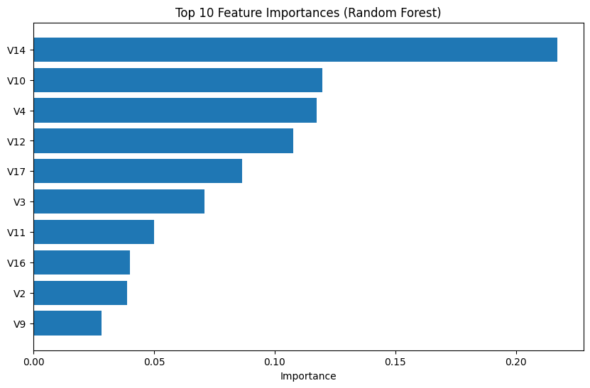
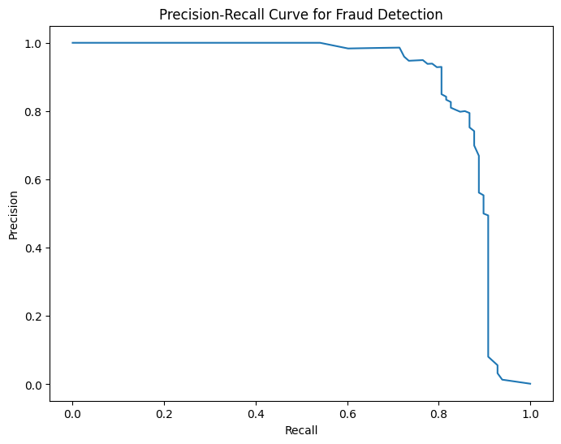
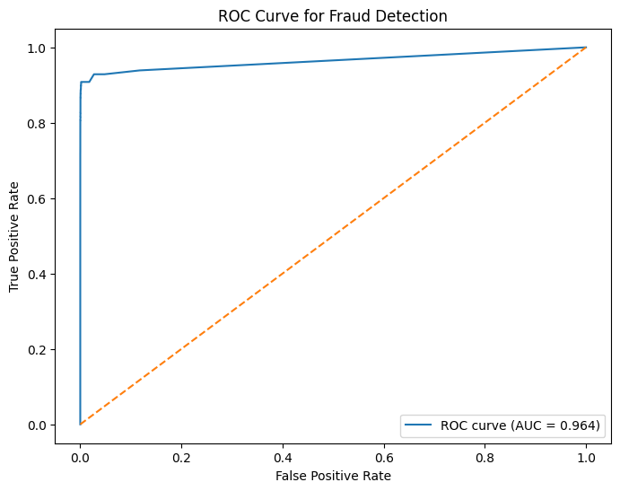

# AI Financial Fraud Detection using Machine
## Research Motivation

Financial fraud is a growing global challenge that affects banks, payment systems, and digital financial platforms. As financial transactions increasingly move to digital envirinments, the scale and complexity of fraud schemes continue to evolve. 
Traditional rule-based fraud detection systems often struggle to identify new and sophisticated fraud patterns. Machine learning approaches offer a powerful alternative by enabling systems to learn patterns from historical transaction data and detect anomalies that may indicate fraudulent behavior.
This project explores how machine learning techniques can be applied to financial transaction data to improve fraud detection capabilities. In particular, the project focuses on handling extreme class imblance and evaluating models using precision-recall metrics, which are more appropriate for rare-event detection.
The goal of this project is to demonstrate how AI-driven analytics can contribute to stronger financial risk management systems and help protect consumers and financial institutions from fraud-related losses.

## Project Summary
	
This project presents a machine learning approach to detecting fraudulent financial transactions using transaction-level data. The workflow includes data preprocessing, exploratory  data analysis, class imbalancehandling with SMOTE, Random Forest modeling, and evaluation using precision-recall metrics.
The project demonstrates how AI-based methods can be used to support fraud detection systems and improve financial transaction security.

## Overview
	
Financial fraud detection is a critical challenge for banks and fintech companies. Fraudulent transactions represent only a small fraction of total transactions, making this a highly imbalanced classification problem.
This project demonstrates an end-to-end machine learning pipeline for fraud detection using real-world financial transaction data. The workflow includes exploratory data analysis, baseline modeling, class imbalance handling, model improvement, and intepretation.
A random Forest classifier was trained on balanced data generated using SMOTE. Model performance was evaluated using metrics that are more informative for rare-event detection, including precision, recall, and F1-score.
The project also includes feature importance analysis to imrpove model interpretability and provide insight into the variables that contribute most to fraud detection.

## Dataset
	
The project uses the Credit Card Fraud Detection dataset, which contains anonymized financial transaction records.
Key characteristics of the dataset:
-	Highly imbalanced transaction classes
-	Fraudulent transactions represent approximately 0.17% of all transactions
-	Features are anonymized and transformed for privacy protection 

## Machine Learning Pipeline

Data → Preprocessing → Train/Test Split → SMOTE Balancing → Random Forest Model → Evaluation

Main steps included:

- Data loading and cleaning
- Exploratory data analysis
- Class imbalance handling with SMOTE
- Training a Random Forest classifier
- Evaluating fraud detection performance
- Analyzing feature importance

## Model Performance

The Random Forest model trained on balanced data achieved the following results for the fraud class:

| Metric | Fraud Class |
|--------|-------------|
| Precision | 0.83 |
| Recall | 0.83 |
| F1-score | 0.83 |

These results show strong performance in detecting rare fraudulent transactions while maintaining a reasonable balance between precision and recall.

## Feature Importance

The Random Forest model provides feature importance estimates that help identify which variables contribute most to fraud detection.
	

## Precision-Recall Curve

Fraud detection models should be evaluated with precision-recall metrics because fraudulent events are rare and standard accuracy can be misleading.

## ROC Curve
The ROC curve provides an additional view of model discrimination performance across different classification thresholds.

## Technologies Used

•	Python
•	Pandas
•	NumPy
•	Scikit-learn
•	Imbalanced-learn (SMOTE)
•	Matplotlib
•	Jupyter Notebook

## Future Improvements

Potencial future enhancements include:
-	Testing Gradient Boosting models such as XGBoost or LightGBM
-	Improving feature engineering
-	Building a real-time fraud detection pipeline
-	Deploying the model as an API
-	Comparing multiple classification algorithms

## Author

Data science project focused on AI-driven financial risk modeling and fraud detection.

## Skills Demonstrated

This project demonstrates practical experience in:

- Data preprocessing
- Exploratory data analysis
- Handling imbalanced datasets
- Machine learning model development
- Fraud detection analytics
- Model evaluation and interpretation
- Financial risk analytics

